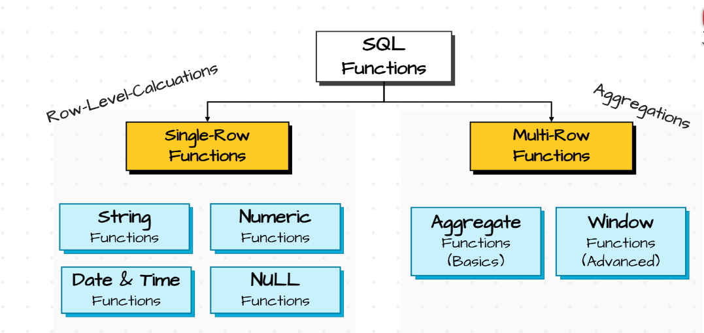

# SQL Functions 

## Tipos de Funciones

### String Functions

1.  Manipulation 
    - CONCAT
    - UPPER
    - LOWER
    - TRIM
    - REPLACE
2. Calculation
    - LEN
3. STRING EXTRACTION 
    - LEFT
    - RIGTH
    - SUBSTRING

| Función   | Descripción | Ejemplo en SQL Server | Resultado Esperado |
|-----------|------------|------------------------|---------------------|
| CONCAT    | Combines multiple strings into one | SELECT CONCAT('Hola', ' ', 'Mundo') AS Resultado; | Hola Mundo |
| UPPER     | Converts all characters to uppercase | SELECT UPPER('hola mundo') AS Resultado; | HOLA MUNDO |
| LOWER     | Converts all characters to lowercase | SELECT LOWER('HOLA MUNDO') AS Resultado; | hola mundo |
| TRIM      | Removes leading and trailing spaces | SELECT TRIM('   Hola Mundo   ') AS Resultado; | Hola Mundo |
| REPLACE   | Replaces specific character with a new character | SELECT REPLACE('Hola Mundo', 'Mundo', 'SQL') AS Resultado; | Hola SQL |
| LEN       | Counts how many characters | SELECT LEN('Hola') AS Resultado; | 4 |
| LEFT      | Extracts specific number of characters from the start | SELECT LEFT('Hola Mundo', 4) AS Resultado; | Hola |
| RIGHT     | Extracts specific number of characters from the end | SELECT RIGHT('Hola Mundo', 5) AS Resultado; | Mundo |
| SUBSTRING | Extracts a part of string at a specified position | SELECT SUBSTRING('Hola Mundo', 6, 5) AS Resultado; | Mundo |
